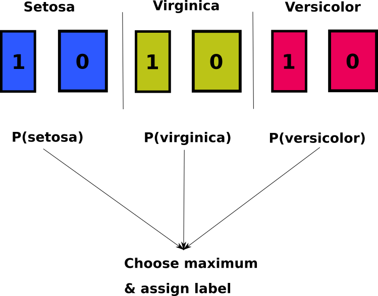
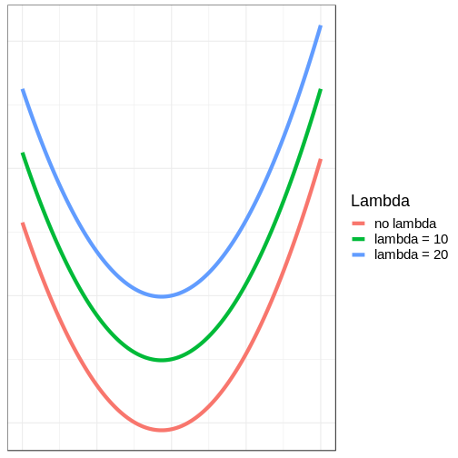

Practical: Multinomial Logistic Regression in R
========================================================
author: Jasper Ginn & Sarah Mod
date: 26/09/2018
autosize: true
font-family: 'Helvetica'
css: custom.css

Table of Contents
========================================================

- Introduction 
- Bias-variance trade-off
- Understanding v. predicting
- A 'naive' multinomial model
- Cross-validation
- Regularization
- Appendices

Introduction
========================================================

Execute the following in a terminal:

```shell
docker pull jhginn/practical_mvsuu
```

Then:

```shell
docker run -e PASSWORD=stats -p 8787:8787 jhginn/practical_mvsuu
```

Go to [http://localhost:8787](http://localhost:8787)
 
Bias-Variance Trade-Off 
========================================================

$$
Total\:error = Bias + Variance + Var(\epsilon)
$$

<center></center>

Understanding v. Prediction
========================================================


A 'naive' model
========================================================



Simple Cross-validation
========================================================


Regularization
========================================================

- Log-likelihood function is what we try to optimize over successive iterations of the algorithm
  - Intuition: the outcomes must be *likely* given the data
  
  $$\mathcal{L}(\hat{y}, y) = y \log(\hat{y}) + (1-y) \log(1-\hat{y}) \\$$

- We try to minimize the log-likelihood through successive iterations. 
- Much like we do with Newton-Rhapson

Intuition
========================================================

- How? Add a penalty term to likelihood so we don't overfit!
  - Aim:
      - Introduce more bias / restrict variance
      - Provide more generalizable results
- By increasing the regularization parameter $\lambda$, we 'increase' the minimum cost.

***


 
Appendix: design matrix and responses
=======================================================

$$
y = \begin{bmatrix}
y_0 \\
\vdots \\
y_m
\end{bmatrix}, \: y_i \in \{1, 0\} \\
X = \begin{bmatrix}
x_1 & x_2 & \dots & x_n
\end{bmatrix}, \: \dim(X) = (m, n)
$$

Appendix: Log-likelihood & L2-Norm 
=======================================================

$$
w = \begin{bmatrix}
w_1 \\
\vdots \\
w_n
\end{bmatrix}, \: b \in \mathbb{R}, \:
\hat{y} = \sigma(wX^{T} + b) \\
\mathcal{L}(\hat{y}, y) = y \log(\hat{y}) + (1-y) \log(1-\hat{y}) \\
\mathcal{J}(w, b) = -\frac{1}{m} \sum_{i=1}^m \mathcal{L}(\hat{y}, y) + \frac{\lambda}{2m} ||w||^2_2 \\
||w||^2_2 = w^{T} \cdot w, \: \lambda \in \mathbb{R}
$$

Appendix: pseudo-code
=======================================================

```
## Set parameters w and b to 0
w = matrix(0L, ncol=ncol(X))
b = 0
## Update parameters
for i in max_iterations:
  ## Linear combination & sigmoid function
  model = sigmoid(w %*% t(X) + b)
  ## Compute cost
  cost = -(1/m) * sum(y*log(yhat) + (1-y) * log(1-yhat)) + (lambda/2m * norm(w))
  ## Compute gradients
  dw = (1/m) * (t(X) %*% matrix(A-Y, ncol=1)) + t((lambda / m) * w)
  db = (1/m) * sum(A-Y)
  ## Update parameters
  w = w - t(learning_rate * dw)
  b = as.vector(b - t(learning_rate * db))
```

Appendix: Links
=======================================================

- [`mnlr` R package](https://github.com/JasperHG90/mnlr) used for multinomial logistic regression
- [github repository with slides](https://github.com/JasperHG90/multivariate_statistics_uu)
- [github repository with practical & Dockerfile]()
- [Docker image on Dockerhub]()

Appendix: Resources
=======================================================

- [Introduction to statistical learning](https://www-bcf.usc.edu/~gareth/ISL/)
  - Bias-variance trade-off (p.30)
  - Simple cross-validation (p.176)
  - Shrinkage methods (pp.214-227)
- [Docker documentation](https://docs.docker.com/)
